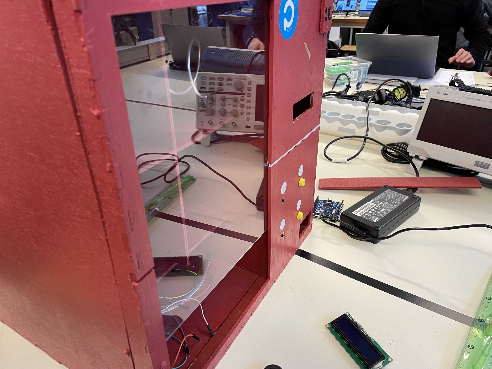
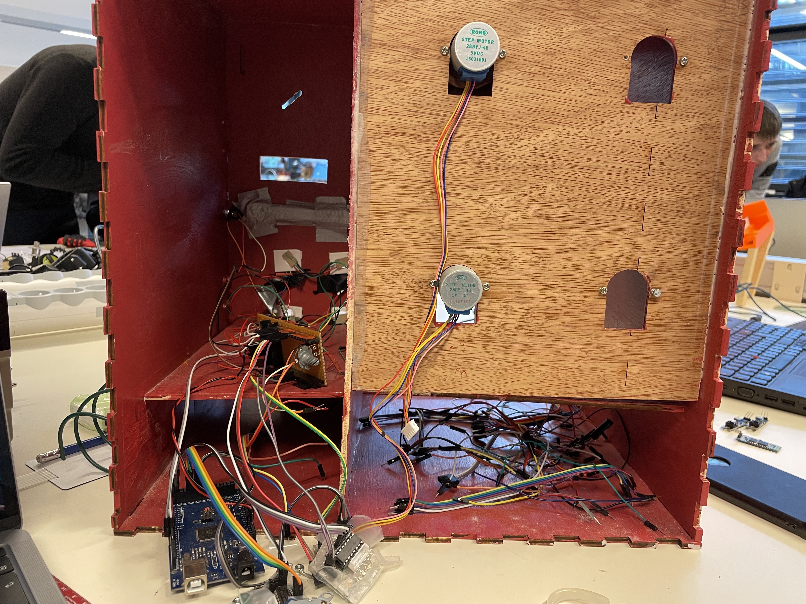
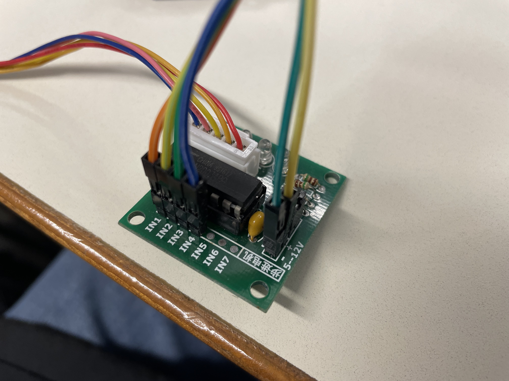

# Séance 1 : 14 décembre 2022

## Evan

### Démontage d'un précédent projet de distributeur automatique
Récupération des moteurs pas à pas, du système de tri des pièces et des divers autres composants





### Tests de fonctionnement des moteurs pas à pas
A partir des branchements de l'ancien projet, j'ai pu isoler la partie dédiée au fonctionnement des moteurs pas à pas.  
Celle-ci utilise un `ULN2003APG` pour gérer les controles.  
J'ai utilisé la librairie [Stepper](https://docs.arduino.cc/learn/electronics/stepper-motors) pour communiquer avec la puce qui controle le moteur pas à pas.  

Exemple de code :

```c
#include <Stepper.h>
const int stepsPerRevolution = 2048;
const int rpm = 12;
Stepper stepper1 = Stepper(stepsPerRevolution, 8, 10, 9, 11);

void setup() {
  stepper1.setSpeed(rpm);
}

void loop() {
  stepper1.step(-stepsPerRevolution);
}
```





## Téo
